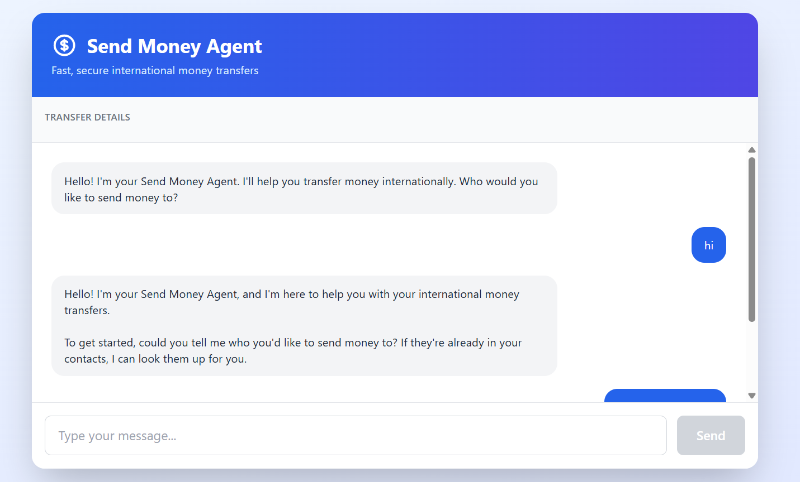

# 💸 Send Money Agent - ADK Implementation


*[Upload your frontend screenshot here]*

---

## 📋 Table of Contents
- [Overview](#overview)
- [Assignment Context](#assignment-context)
- [Architecture](#architecture)
- [Technology Stack](#technology-stack)
- [Design Choices & Rationale](#design-choices--rationale)
- [Agent Implementation](#agent-implementation)
- [State Management](#state-management)
- [Tool System](#tool-system)
- [Frontend Design](#frontend-design)
- [API Endpoints](#api-endpoints)
- [Setup & Installation](#setup--installation)
- [Usage Examples](#usage-examples)
- [Interview Talking Points](#interview-talking-points)

---

## 🎯 Overview

This is a **conversational AI agent** built with **Google Agent Development Kit (ADK)** that helps users complete international money transfers through natural language interactions. The agent intelligently collects required information, handles ambiguity, manages state across conversation turns, and provides a seamless user experience.

**Key Capabilities:**
- 🗣️ Natural language understanding for money transfer requests
- 🧠 Intelligent state tracking across multi-turn conversations  
- 🔍 Tool-based search and validation (contacts, countries, exchange rates)
- ✏️ Handles corrections and clarifications mid-conversation
- 🌍 Support for international transfers to 10+ countries
- 💱 Real-time foreign exchange rate calculations
- ✅ Complete transfer summary generation

---

## 📝 Assignment Context

### Original Requirements

The assignment was to create a **Send Money Agent** that:

1. **Starts from open-ended requests** - "I want to send money"
2. **Collects missing information** progressively (country, amount, beneficiary, delivery method)
3. **Asks conversationally** - Natural flow, not form-filling
4. **Handles corrections** - User can change details mid-flow
5. **Tracks internal state** - Knows what's collected, what's pending
6. **Provides confirmation** - Summary of all collected information
7. **Handles ambiguity (Optional)** - Clarifying questions when needed

### Solution Approach

I designed the solution to be:
- ✅ **ADK-native** - Uses ADK's tool-calling and content generation patterns
- ✅ **Self-contained** - No external routers, stays within ADK flow model
- ✅ **Stateful** - Persistent session-based state management
- ✅ **Extensible** - Easy to add new tools, countries, or validation logic
- ✅ **Production-ready** - Docker containerized, REST API, modern UI

---

## 🏗️ Architecture

```
┌─────────────────────────────────────────────────────────────┐
│                    USER INTERFACE (React)                    │
│  - Chat Interface                                            │
│  - State Visualization Panel                                 │
│  - Clarification Buttons                                     │
└───────────────────────┬─────────────────────────────────────┘
                        │ HTTP/REST
                        ▼
┌─────────────────────────────────────────────────────────────┐
│              FASTAPI BACKEND (Session Manager)               │
│  - Session Management (In-memory store)                      │
│  - Chat History Tracking                                     │
│  - Request/Response Handling                                 │
└───────────────────────┬─────────────────────────────────────┘
                        │
                        ▼
┌─────────────────────────────────────────────────────────────┐
│               GOOGLE ADK AGENT (Core Logic)                  │
│                                                              │
│  ┌────────────────────────────────────────────────┐         │
│  │  Gemini Model (gemini-2.0-flash-exp)          │         │
│  │  - Natural Language Understanding              │         │
│  │  - Tool Call Generation                        │         │
│  │  - Response Generation                         │         │
│  └─────────────────────┬──────────────────────────┘         │
│                        │                                     │
│                        ▼                                     │
│  ┌────────────────────────────────────────────────┐         │
│  │         TOOL EXECUTION LAYER                   │         │
│  │  - search_contacts()                           │         │
│  │  - get_supported_countries()                   │         │
│  │  - calculate_fx_rate()                         │         │
│  └────────────────────────────────────────────────┘         │
│                                                              │
│  ┌────────────────────────────────────────────────┐         │
│  │         STATE MANAGEMENT (Pydantic)            │         │
│  │  - TransferState Schema                        │         │
│  │  - Field Validation                            │         │
│  │  - Clarification Tracking                      │         │
│  └────────────────────────────────────────────────┘         │
└─────────────────────────────────────────────────────────────┘
```

### Flow Diagram

```
User Input → FastAPI → Session Lookup → ADK Agent → Tool Calls?
                                              │          ↓
                                              │      Execute Tools
                                              │          ↓
                                              │    Update State
                                              ↓          │
                                        LLM Response ←───┘
                                              │
                                              ↓
                                        Return to User
```

---

## 🛠️ Technology Stack

### Backend
| Technology | Version | Purpose |
|-----------|---------|---------|
| **Google ADK** | 1.0.0 | Agent framework with tool-calling capabilities |
| **Gemini 2.0 Flash Exp** | Latest | LLM for natural language understanding & generation |
| **FastAPI** | 0.115.0 | High-performance async REST API framework |
| **Pydantic** | 2.9.0 | Data validation and state schema definition |
| **Uvicorn** | 0.32.0 | ASGI server for FastAPI |
| **Python** | 3.11+ | Core programming language |

### Frontend
| Technology | Purpose |
|-----------|---------|
| **React** | 18.x | UI component framework |
| **Tailwind CSS** | 3.x | Utility-first CSS framework |
| **React Hooks** | State management & lifecycle |

### Infrastructure
| Technology | Purpose |
|-----------|---------|
| **Docker** | Containerization |
| **Docker Compose** | Multi-container orchestration |
| **GitHub Codespaces** | Cloud development environment |

---

## 🎨 Design Choices & Rationale

### 1. **Why Google ADK?**

**Choice:** Google Agent Development Kit (ADK) with Gemini 2.0 Flash Exp

**Rationale:**
- ✅ **Native tool-calling** - Built-in function calling without custom parsing
- ✅ **Production-ready** - Google's official SDK with ongoing support
- ✅ **Gemini 2.0 advantages** - Better reasoning, lower latency, cost-effective
- ✅ **Structured outputs** - Easy tool result processing
- ✅ **Assignment compliance** - Specifically requested in requirements

**Alternative considered:** LangChain, but rejected due to:
- Higher abstraction overhead
- Not aligned with ADK requirement
- More complexity than needed

### 2. **State Management Strategy**

**Choice:** Pydantic-based `TransferState` schema with session persistence

**Rationale:**
```python
class TransferState(BaseModel):
    beneficiary_name: Optional[str] = None
    beneficiary_id: Optional[str] = None
    destination_country: Optional[str] = None
    amount: Optional[float] = None
    currency: str = "USD"
    delivery_method: Optional[str] = None
    needs_clarification: bool = False
    clarification_options: List[dict] = []
    last_asked_field: Optional[str] = None
```

- ✅ **Type safety** - Pydantic validates all state updates
- ✅ **Optional fields** - Reflects progressive information gathering
- ✅ **Clarification tracking** - Separate flags for ambiguity handling
- ✅ **Serializable** - Easy to pass to frontend and persist
- ✅ **Self-documenting** - Clear schema for all tracked information

**Alternative considered:** Dictionary-based state
- Rejected due to lack of type safety and validation

### 3. **Tool Design Philosophy**

**Choice:** Three focused tools instead of one generic tool

**Tools:**
1. `search_contacts(query: str)` - Beneficiary lookup
2. `get_supported_countries()` - Country validation
3. `calculate_fx_rate(amount: float, country: str)` - Exchange rate calculation

**Rationale:**
- ✅ **Separation of concerns** - Each tool has single responsibility
- ✅ **Clear tool descriptions** - LLM understands when to use each
- ✅ **Composability** - Tools can be combined in conversations
- ✅ **Testability** - Each function independently testable
- ✅ **Extensibility** - Easy to add more tools (e.g., delivery methods, fees)

**Alternative considered:** Single "get_info" tool
- Rejected: Too generic, harder for LLM to use correctly

### 4. **Conversation Flow Design**

**Choice:** LLM-driven progressive disclosure

**How it works:**
```
User: "I want to send money"
Agent: (determines all fields empty)
      "Who would you like to send money to?"

User: "John"
Agent: (calls search_contacts("John"))
      (finds 2 matches)
      "I found 2 Johns. Which one?"
      [John Smith - Brazil]
      [John Smith - Mexico]

User: "The one in Brazil"
Agent: (updates state with beneficiary + country)
      "Great! How much would you like to send to John Smith in Brazil?"

User: "$500"
Agent: (calls calculate_fx_rate(500, "Brazil"))
      "$500 USD = 2,625 BRL at today's rate. 
      How would you like them to receive it?"
```

**Rationale:**
- ✅ **Natural conversation** - Not a rigid form
- ✅ **Context aware** - Asks for what's missing, not everything
- ✅ **Handles ambiguity** - Clarifying questions when needed
- ✅ **Allows corrections** - User can change any detail
- ✅ **Provides value** - Shows exchange rates proactively

### 5. **Session Management**

**Choice:** In-memory dictionary with UUID session IDs

```python
sessions: Dict[str, dict] = {
    "session_id": {
        "state": TransferState(),
        "history": [],
        "chat": None  # ADK chat instance
    }
}
```

**Rationale:**
- ✅ **Simplicity** - No database setup needed for demo
- ✅ **Stateful conversations** - Maintains context across turns
- ✅ **Independent sessions** - Multiple concurrent users
- ✅ **Easy debugging** - Inspect state in memory

**Production upgrade path:** Replace with Redis or PostgreSQL

### 6. **Frontend Architecture**

**Choice:** Single-page React app with real-time state visualization

**Features:**
- **Chat interface** - Message history with role-based styling
- **State panel** - Live view of collected information
- **Clarification UI** - Buttons for quick selections
- **Loading states** - User feedback during processing

**Rationale:**
- ✅ **Transparency** - User sees what agent knows
- ✅ **Confidence building** - Visual progress indicator
- ✅ **Better UX** - Clickable options vs typing
- ✅ **Interview demo** - Easy to showcase agent's state tracking

---

## 🤖 Agent Implementation

### System Instruction

The agent's behavior is defined by a comprehensive system instruction:

```python
def create_system_instruction() -> str:
    return """You are a helpful Send Money Agent that assists users 
    in transferring money internationally.

    Your role is to:
    1. Collect all necessary information: beneficiary name, destination 
       country, amount, and delivery method
    2. Use the search_contacts tool to find beneficiaries
    3. Use get_supported_countries to show available destinations
    4. Use calculate_fx_rate to provide exchange rate information
    5. If user tries to change any detail, acknowledge it and ask 
       for confirmation
    6. Guide users step by step through the transfer process
    7. Be conversational, friendly, and clear
    8. Once all information is collected, provide a summary

    When a user provides information:
    - Search for beneficiaries using search_contacts
    - If multiple matches found, ask user to clarify
    - Validate country against supported countries list
    - Calculate exchange rates when amount and country are known
    - Ask for delivery method (Bank Transfer, Cash Pickup, Mobile Wallet)

    If user wants to change something:
    - Acknowledge the change
    - Ask for confirmation
    - Update the information only after confirmation

    Be proactive in asking for missing information one piece at a time.
    """
```

### Tool Call Flow

```python
# 1. User sends message
response = chat.send_message(user_message)

# 2. Check if model wants to use tools
if response.candidates[0].content.parts[0].function_call:
    # 3. Extract tool call details
    tool_call = response.candidates[0].content.parts[0].function_call
    tool_name = tool_call.name
    tool_args = dict(tool_call.args)
    
    # 4. Execute tool
    result = execute_tool(tool_name, tool_args)
    
    # 5. Update state based on result
    state = update_state_from_tool_result(result, state)
    
    # 6. Send tool result back to model
    tool_response_part = Part.from_function_response(
        name=tool_name,
        response=result
    )
    
    # 7. Get final response
    final_response = chat.send_message(tool_response_part)
```

### Handling Multi-Turn Conversations

The agent maintains context through:

1. **Session-based chat history** - Each session has its own `Chat` instance
2. **State updates** - TransferState persisted between turns
3. **Tool results** - Incorporated into conversation history
4. **System instruction** - Consistent behavior across all turns

```python
def get_or_create_session(session_id: str) -> dict:
    if session_id not in sessions:
        sessions[session_id] = {
            "state": TransferState(),
            "history": [],
            "chat": client.chats.create(
                model="gemini-2.0-flash-exp",
                config=GenerateContentConfig(
                    system_instruction=create_system_instruction(),
                    tools=get_tools(),
                    temperature=0.7
                )
            )
        }
    return sessions[session_id]
```

---

## 📊 State Management

### State Schema

```python
class TransferState(BaseModel):
    """State tracking for money transfer process"""
    
    # Core transfer details
    beneficiary_name: Optional[str] = None      # Who receives the money
    beneficiary_id: Optional[str] = None        # Internal ID for beneficiary
    destination_country: Optional[str] = None   # Where money is going
    amount: Optional[float] = None              # How much (in USD)
    currency: str = "USD"                       # Source currency
    delivery_method: Optional[str] = None       # How they receive it
    
    # Conversation management
    needs_clarification: bool = False           # Ambiguity detected?
    clarification_options: List[dict] = []      # Options to choose from
    last_asked_field: Optional[str] = None      # Last field we asked about
```

### State Transitions

```
Initial State (All None)
  ↓
[User mentions beneficiary]
  ↓
search_contacts() called
  ↓
├── Single match → beneficiary_name, beneficiary_id, destination_country set
└── Multiple matches → needs_clarification=True, options populated
      ↓
    [User selects option]
      ↓
    Clarification resolved → beneficiary fields set
      ↓
[Amount provided]
  ↓
amount field set → calculate_fx_rate() called
  ↓
[Delivery method requested]
  ↓
delivery_method set
  ↓
Complete State → Generate Summary
```

### State Validation

Pydantic handles automatic validation:
- Type checking (str, float, bool)
- Optional vs Required fields
- Default values
- Serialization to/from JSON

---

## 🔧 Tool System

### Tool 1: Search Contacts

**Purpose:** Find beneficiaries by name, handling ambiguity

```python
def search_contacts(query: str) -> dict:
    """Search for beneficiaries by name"""
    matches = [c for c in MOCK_CONTACTS 
               if query.lower() in c["name"].lower()]
    
    if len(matches) == 0:
        return {
            "found": False,
            "message": f"No beneficiary found with name '{query}'"
        }
    elif len(matches) == 1:
        return {
            "found": True,
            "single": True,
            "contact": matches[0]  # {id, name, country}
        }
    else:
        return {
            "found": True,
            "multiple": True,
            "matches": matches,
            "message": f"Found {len(matches)} beneficiaries"
        }
```

**Mock Data:**
```python
MOCK_CONTACTS = [
    {"id": "B001", "name": "John Smith", "country": "Brazil"},
    {"id": "B002", "name": "John Smith", "country": "Mexico"},
    {"id": "B003", "name": "Maria Garcia", "country": "Spain"},
    {"id": "B004", "name": "Carlos Rodriguez", "country": "Argentina"},
    {"id": "B005", "name": "Ana Silva", "country": "Portugal"},
]
```

**Why this design?**
- Handles exact and partial matches
- Returns structured data for different scenarios
- Enables ambiguity resolution (multiple Johns)

### Tool 2: Get Supported Countries

**Purpose:** Show where transfers are available

```python
def get_supported_countries() -> dict:
    return {
        "countries": SUPPORTED_COUNTRIES,
        "count": len(SUPPORTED_COUNTRIES)
    }

SUPPORTED_COUNTRIES = [
    "Brazil", "Mexico", "Spain", "Argentina", "Portugal",
    "United Kingdom", "Canada", "India", "Philippines", "Colombia"
]
```

**When used:**
- User asks "Where can I send money?"
- Agent validates user-provided country
- Country selection UI population

### Tool 3: Calculate FX Rate

**Purpose:** Real-time exchange rate calculation

```python
def calculate_fx_rate(amount: float, country: str) -> dict:
    if country not in EXCHANGE_RATES:
        return {"error": True, "message": "Rate not available"}
    
    rate_info = EXCHANGE_RATES[country]
    total_foreign = amount * rate_info["rate"]
    
    return {
        "success": True,
        "source_amount": amount,
        "source_currency": "USD",
        "destination_currency": rate_info["symbol"],
        "exchange_rate": rate_info["rate"],
        "destination_amount": round(total_foreign, 2),
        "country": country
    }
```

**Mock Exchange Rates:**
```python
EXCHANGE_RATES = {
    "Brazil": {"rate": 5.25, "symbol": "BRL"},
    "Mexico": {"rate": 18.50, "symbol": "MXN"},
    "Spain": {"rate": 0.92, "symbol": "EUR"},
    # ... etc
}
```

**Why mock data?**
- No external API dependencies
- Consistent demo behavior
- Fast response times
- Easy to add more countries

**Production upgrade:** Integrate with real FX API (e.g., exchangerate-api.com)

---

## 🎨 Frontend Design

### Component Structure

```jsx
<App>
  ├── Header
  │   ├── Title: "Send Money Agent"
  │   └── Subtitle: "Fast, secure transfers"
  │
  ├── TransferStatusPanel
  │   ├── Beneficiary Info
  │   ├── Destination Country
  │   ├── Amount & Currency
  │   └── Delivery Method
  │
  ├── ChatContainer
  │   ├── MessageList
  │   │   ├── UserMessage (blue, right-aligned)
  │   │   ├── AssistantMessage (gray, left-aligned)
  │   │   └── ErrorMessage (red)
  │   │
  │   └── ClarificationButtons (conditional)
  │       └── [Option1] [Option2] [Option3]
  │
  └── InputArea
      ├── TextInput
      └── SendButton
```

### Key Features

#### 1. Real-Time State Visualization

```jsx
{currentState && (
  <div className="bg-blue-50 p-4">
    <h2>Transfer Details</h2>
    {currentState.beneficiary_name && (
      <div>
        <span>Beneficiary:</span>
        <span>{currentState.beneficiary_name}</span>
      </div>
    )}
    {/* Similar for country, amount, etc. */}
  </div>
)}
```

**Benefits:**
- User sees collected information
- Builds trust in agent
- Easy to spot errors
- Great for interview demo

#### 2. Clarification UI

```jsx
{showClarificationButtons && (
  <div className="clarification-options">
    {currentState.clarification_options.map(option => (
      <button 
        key={option.id}
        onClick={() => handleClarificationClick(option)}
      >
        {option.label}
      </button>
    ))}
  </div>
)}
```

**Example:** When searching "John" returns multiple results:
```
Assistant: "I found 2 beneficiaries named John. Please select one:"

[John Smith - Brazil]  [John Smith - Mexico]
```

#### 3. Auto-Scroll & Loading States

```jsx
// Auto-scroll to latest message
useEffect(() => {
  messagesEndRef.current?.scrollIntoView({ behavior: 'smooth' });
}, [messages]);

// Loading indicator while waiting for response
{isLoading && (
  <div className="loading-indicator">
    <div className="spinner" />
    <span>Agent is thinking...</span>
  </div>
)}
```

### Styling Approach

**Tailwind CSS** for rapid UI development:
- Utility-first classes
- Responsive design built-in
- Consistent spacing and colors
- Gradient backgrounds for modern look

```jsx
<div className="min-h-screen bg-gradient-to-br from-blue-50 to-indigo-100">
  <div className="bg-gradient-to-r from-blue-600 to-indigo-600 text-white">
    {/* Header content */}
  </div>
</div>
```

---

## 🌐 API Endpoints

### Base URL
- Development: `http://localhost:8000`
- Codespaces: Auto-detected in frontend

### Endpoints

#### 1. Create Session
```http
POST /session/create
```

**Response:**
```json
{
  "session_id": "uuid-v4-string",
  "message": "Session created successfully"
}
```

**Purpose:** Initialize new conversation session

---

#### 2. Send Chat Message
```http
POST /chat
Content-Type: application/json

{
  "session_id": "uuid-v4-string",
  "message": "I want to send $200 to John"
}
```

**Response:**
```json
{
  "session_id": "uuid-v4-string",
  "response": "I found 2 beneficiaries named John. Which one would you like to send money to?\n\n1. John Smith - Brazil\n2. John Smith - Mexico",
  "state": {
    "beneficiary_name": null,
    "beneficiary_id": null,
    "destination_country": null,
    "amount": 200.0,
    "currency": "USD",
    "delivery_method": null,
    "needs_clarification": true,
    "clarification_options": [
      {
        "id": "B001",
        "label": "John Smith - Brazil"
      },
      {
        "id": "B002",
        "label": "John Smith - Mexico"
      }
    ],
    "last_asked_field": "beneficiary"
  }
}
```

**Purpose:** Main conversation endpoint with state updates

---

#### 3. Get Session State
```http
GET /session/{session_id}/state
```

**Response:**
```json
{
  "session_id": "uuid-v4-string",
  "state": { /* TransferState object */ }
}
```

**Purpose:** Retrieve current session state

---

#### 4. Reset Session
```http
POST /session/{session_id}/reset
```

**Response:**
```json
{
  "session_id": "uuid-v4-string",
  "message": "Session reset successfully"
}
```

**Purpose:** Clear session and start fresh

---

### Error Handling

All endpoints return structured errors:

```json
{
  "detail": "Session not found"
}
```

**HTTP Status Codes:**
- `200` - Success
- `404` - Session not found
- `422` - Validation error
- `500` - Internal server error

---

## 🚀 Setup & Installation

### Prerequisites
- Docker & Docker Compose
- Google API Key (Gemini)

### Environment Setup

1. **Clone the repository:**
```bash
git clone <repository-url>
cd payment-agent-ADK
```

2. **Create `.env` file in `/backend` directory:**
```bash
cd backend
cat > .env << EOF
GOOGLE_API_KEY=your_api_key_here
EOF
```

3. **Get Google API Key:**
   - Go to [Google AI Studio](https://makersuite.google.com/app/apikey)
   - Create new API key
   - Copy to `.env` file

### Running with Docker (Recommended)

```bash
# From project root
docker-compose up --build
```

**Access:**
- Frontend: http://localhost:3000
- Backend API: http://localhost:8000
- API Docs: http://localhost:8000/docs

### Running Locally (Development)

**Backend:**
```bash
cd backend
pip install -r requirements.txt
uvicorn main:app --reload --port 8000
```

**Frontend:**
```bash
cd frontend
npm install
npm start
```

### Verify Installation

```bash
# Test backend health
curl http://localhost:8000/

# Create test session
curl -X POST http://localhost:8000/session/create
```

---

## 💬 Usage Examples

### Example 1: Simple Transfer

```
User: I want to send money

Agent: Hello! I'm your Send Money Agent. Who would you like to send money to?

User: Maria

Agent: Great! I found Maria Garcia in our contacts. How much would you like to send to Maria Garcia in Spain?

User: $300

Agent: Perfect! With today's exchange rate, $300 USD equals 276.00 EUR. How would you like Maria to receive the money?

User: Bank transfer

Agent: Excellent! Here's your transfer summary:

📋 Transfer Summary:
• Beneficiary: Maria Garcia
• Destination: Spain
• Amount: $300.00 USD (276.00 EUR)
• Delivery Method: Bank Transfer
• Exchange Rate: 0.92 EUR per USD

Your transfer is ready to be processed!
```

### Example 2: Handling Ambiguity

```
User: Send $500 to John

Agent: I found 2 beneficiaries named John. Which one would you like to send money to?

[John Smith - Brazil]  [John Smith - Mexico]

User: [Clicks "John Smith - Brazil"]

Agent: Great choice! You're sending $500 USD to John Smith in Brazil. With today's rate, that's 2,625.00 BRL. How should John receive the money?

User: Cash pickup

Agent: Perfect! Here's your transfer summary:

📋 Transfer Summary:
• Beneficiary: John Smith
• Destination: Brazil
• Amount: $500.00 USD (2,625.00 BRL)
• Delivery Method: Cash pickup
• Exchange Rate: 5.25 BRL per USD

Ready to proceed!
```

### Example 3: Making Corrections

```
User: I want to send $100 to Carlos

Agent: I found Carlos Rodriguez in Argentina. Is this correct?

User: Actually, can I change the amount to $200?

Agent: Of course! I've updated the amount to $200 USD. For Argentina, that's 70,000.00 ARS at today's rate. How would you like Carlos to receive this?

User: Mobile wallet

Agent: Perfect! Here's your updated transfer:

📋 Transfer Summary:
• Beneficiary: Carlos Rodriguez
• Destination: Argentina
• Amount: $200.00 USD (70,000.00 ARS)
• Delivery Method: Mobile wallet
• Exchange Rate: 350.00 ARS per USD

All set!
```

---

## 🎤 Interview Talking Points

### Architecture Discussion

**Key points to emphasize:**

1. **ADK-First Design:**
   - "I chose Google ADK because it provides native tool-calling capabilities without custom parsing logic"
   - "The Gemini 2.0 Flash Exp model offers excellent reasoning for conversational flows"
   - "Stayed within ADK's patterns - no external routers needed"

2. **State Management:**
   - "Used Pydantic for type-safe state schema"
   - "State persists across conversation turns via session management"
   - "Separation of concerns: state validation vs conversation logic"

3. **Tool Design:**
   - "Three focused tools instead of one generic tool"
   - "Each tool has single responsibility"
   - "Tools are composable - agent decides when to use them"

4. **Conversation Flow:**
   - "LLM-driven progressive disclosure - asks for what's missing"
   - "Handles ambiguity through clarification flow"
   - "Allows corrections mid-conversation"

### Running the Demo

**Demo Script:**

1. **Show UI:** "Clean, conversational interface with real-time state visualization"

2. **Simple Case:** "Let me send money to Maria"
   - Point out state updates
   - Show exchange rate calculation
   - Complete flow

3. **Ambiguity Handling:** "Send money to John"
   - Show clarification UI
   - Explain how agent detects ambiguity
   - Demonstrate resolution

4. **Correction:** Change amount mid-flow
   - Show agent acknowledges
   - State updates correctly
   - Conversation continues naturally

5. **Show Code:**
   - `flows.py` - Tool definitions
   - `TransferState` - State schema
   - System instruction - Agent behavior

### Technical Deep-Dives

#### Q: "Why ADK over LangChain?"

**Answer:**
- ADK is Google's official framework with first-class Gemini support
- Simpler mental model - native tool calling without LCEL chains
- Better performance with Gemini models
- Assignment specifically requested ADK
- Production-ready with ongoing support

#### Q: "How do you handle state across turns?"

**Answer:**
- Session-based architecture with UUID identifiers
- Each session has persistent `TransferState` and `Chat` instance
- Pydantic validates state updates
- Chat history maintained by ADK automatically
- Tool results incorporated into conversation context

#### Q: "How would you scale this to production?"

**Answer:**
- **Session storage:** Replace in-memory dict with Redis or PostgreSQL
- **Tool integration:** Connect to real APIs (FX rates, contact DB, payment processor)
- **Authentication:** Add JWT-based user auth
- **Rate limiting:** Implement per-user API quotas
- **Monitoring:** Add logging, metrics (Datadog/New Relic)
- **Load balancing:** Multiple backend instances behind nginx
- **Database:** PostgreSQL for user data, transactions
- **Async processing:** Celery for actual payment execution
- **Security:** Input validation, SQL injection prevention, PII encryption

#### Q: "How do you test the agent?"

**Answer:**
```python
# Unit tests for tools
def test_search_contacts_single_match():
    result = search_contacts("Maria")
    assert result["found"] == True
    assert result["single"] == True
    assert result["contact"]["name"] == "Maria Garcia"

# Integration tests for conversation flow
def test_complete_transfer_flow():
    session = create_session()
    
    # Step 1: Initial request
    response = chat(session, "Send $100 to Maria")
    assert "Maria Garcia" in response
    
    # Step 2: Confirm delivery method
    response = chat(session, "Bank transfer")
    assert session["state"].delivery_method == "Bank Transfer"
    assert session["state"].amount == 100.0
```

#### Q: "What about error handling?"

**Answer:**
- Tool execution wrapped in try-except
- Graceful degradation: If tool fails, agent asks user directly
- Validation at multiple layers: Pydantic, FastAPI, tool functions
- User-friendly error messages
- Logging for debugging

---

## 📚 Key Concepts

### 1. Progressive Disclosure
Asking for information incrementally instead of all at once:
- More natural conversation
- Less overwhelming for users
- Agent decides what to ask next based on current state

### 2. Ambiguity Resolution
When user input could mean multiple things:
- Detect ambiguity (multiple John Smiths)
- Present options clearly
- Wait for explicit selection
- Continue conversation smoothly

### 3. State Tracking
Maintaining context across conversation:
- What information is collected?
- What's still missing?
- Did user request a change?
- Are we ready for confirmation?

### 4. Tool Orchestration
Agent decides which tools to use and when:
- LLM chooses appropriate tool based on context
- Tool results update state
- Tool results inform next question

---

## 🎯 Success Criteria Met

✅ **Starts from open-ended requests** - "I want to send money"  
✅ **Collects missing information** - Progressive questioning  
✅ **Conversational approach** - Natural language, not forms  
✅ **Handles corrections** - User can change details anytime  
✅ **Tracks internal state** - Pydantic schema with session persistence  
✅ **Provides confirmation** - Natural language summary at end  
✅ **Handles ambiguity** - Clarification flow with options  
✅ **ADK-native** - No custom routers, uses ADK patterns  
✅ **Self-contained** - Runs independently with Docker  
✅ **Production-ready UI** - Professional React frontend  

---

## 🔮 Future Enhancements

### Short-term
- [ ] Add more delivery methods (e.g., Home Delivery)
- [ ] Support multiple source currencies
- [ ] Add transfer fee calculation
- [ ] Email confirmation
- [ ] Transfer history

### Long-term
- [ ] Real payment processor integration (Stripe, Wise)
- [ ] Live FX API integration
- [ ] Multi-language support
- [ ] Voice interface
- [ ] Mobile app
- [ ] Recurring transfers
- [ ] Split payments
- [ ] Group transfers

---

## 📖 References

- [Google ADK Documentation](https://ai.google.dev/docs)
- [Gemini API Reference](https://ai.google.dev/api/python/google/generativeai)
- [FastAPI Documentation](https://fastapi.tiangolo.com/)
- [Pydantic Documentation](https://docs.pydantic.dev/)
- [React Documentation](https://react.dev/)

---

## 📄 License

This project is created for educational and interview purposes.

---

## 👤 Author

Developed by **Vitor Barboza** for AI Engineer Technical Interview

**Contact:** [GitHub Profile](https://github.com/vitorsbarboza)

---

## 🙏 Acknowledgments

Built with:
- Google Agent Development Kit (ADK)
- Gemini 2.0 Flash Exp
- FastAPI
- React
- Tailwind CSS

---

**Last Updated:** December 31, 2025
